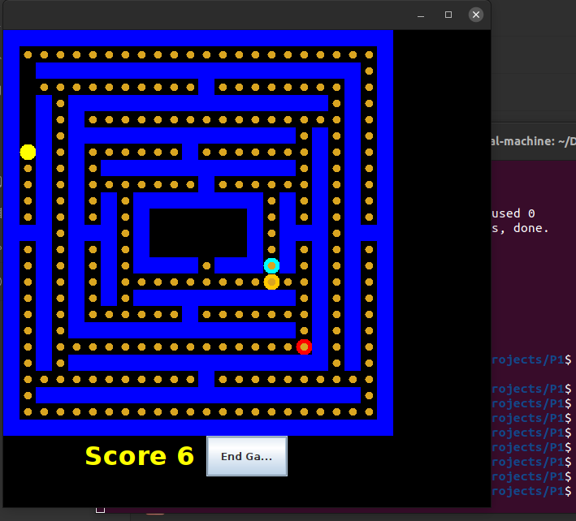

# Team 2 - CMSC389T-Winter22 - Project 1

## Group Members
- Ethan Jaffee
- Surmud Jamil
- Mike Brown
- Ethan Shifflett

## Image of Display

## How to Run
Run these commands in the P1 directory to run the game!
```
javac -cp "src/" src/*.java 
java -cp "src/" StartMenu
```
## Functions
A list of the functions you wrote with a description of the implementation for each function a description of the test you wrote. The descriptions don't have to be long - a sentence or two would suffice.

### Pacman - get_valid_moves()
Returns an ArrayList\<Location\> containing all valid moves for PacMan in the current position. This is implemented simply by checking each surrounding square and adding it to the returned list if its type is not Type.WALL.
### Pacman - move()
For this function I call get_valid_moves to get an ArrayList of the possible moves. Then if the resulting list is empty, the function returns false. Otherwise, it updates the location of the pacman to the first location in the arraylist and returns true. 
### Pacman - is_ghost_in_range()
This function checks a 1 block area around pacman using get location from map. If there is a ghost it returns true
### Pacman - consume()
### Ghost - get_valid_moves()
Returns an ArrayList\<Location\> containing all valid moves for the Ghost in the current position. This is implemented simply by checking each surrounding square and adding it to the returned list if its type is not Type.WALL.
### Ghost - move()
For this function I call get_valid_moves to get an ArrayList of the possible moves. Then if the resulting list is empty, the function returns false. Otherwise, it updates the location of the ghost to the first location in the arraylist and returns true. 
### Ghost - is_pacman_in_range()
This function check if pacman is in a one block radius using get location from map. If pacman is it returns true!
### Ghost - attack()
### Map - move()
Moves a given component (Ghost or PacMan) to the given Location and updates the Map's data. This does not change the local Location values for the component, but updates each field related to their position on the board, as well as the components.
### Map - getLoc(Location loc)
The getLoc function takes in a location and returns a hashset of Type enums that are in that location. To implement it, I initialized a hashset of Type enums to later return. Then I loop through the keys of the fields hashmap, which are locations, and if the location pointer is the same as the parameter location, it is added to the return hashset.
### Map - attack()
If ghost calls this function upon a successfull attack it will update the map and end the game. 
### Map - eatCookie()


